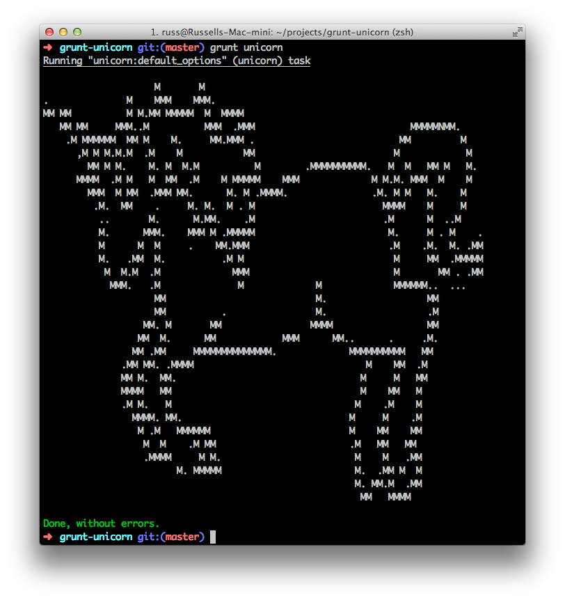

# grunt-unicorn

> Always use grunt, unless you can use grunt-unicorn. Then always use grunt-unicorn.



## Getting Started

If you haven't used [Grunt](http://gruntjs.com/) before, be sure to check out the [Getting Started](http://gruntjs.com/getting-started) guide, as it explains how to create a [Gruntfile](http://gruntjs.com/sample-gruntfile) as well as install and use Grunt plugins. Once you're familiar with that process, you may install this plugin with this command:

```shell
npm install grunt-unicorn --save-dev
```

Once the plugin has been installed, it may be enabled inside your Gruntfile with this line of JavaScript:

```js
grunt.loadNpmTasks('grunt-unicorn');
```

## The "unicorn" task

```js
grunt.initConfig({
  unicorn: {
    options: {
      // Don't put anything here, unless it's a clever comment
    },
    your_target: {
      // I'm not sure why you'd want this yet either
    },
  },
})
```

## Contributing
Very open to feature adds! ALL COMMITS MUST IN SOMEWAY INCLUDE UNICORNS.

## Release History
_(Nothing yet)_
